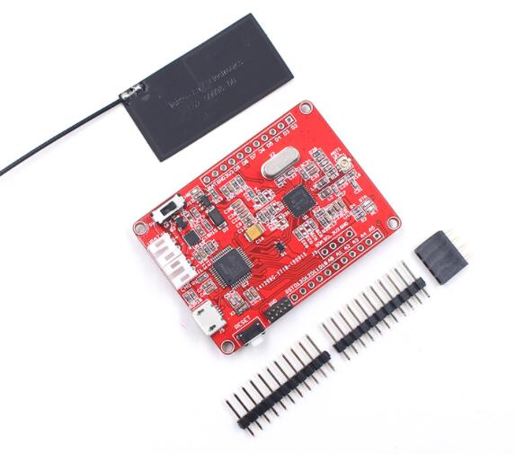

# Maduino Zero NFC
```c++
/*
Version:		V1.0
Author:			Vincent
Create Date:	2022/12/30
Note:
	
*/
```



[toc]

# Makerfabs

[Makerfabs home page](https://www.makerfabs.com/)

[Makerfabs Wiki](https://wiki.makerfabs.com/)

# Maduino Zero NFC
## Intruduce

Product Link ：[Maduino Zero NFC](https://www.makerfabs.com/maduino-zero-nfc.html) 

Wiki Link : [Maduino Zero NFC](https://wiki.makerfabs.com/Maduino_Zero_NFC.html) 


Maduino Zero NFC is an Arduino-compatible small development board with NFC (Near-Field Communication).

This board will be the bridge that helps you wirelessly interact with your environment, drive motors, unlock strikes, control relays, read from a temperature sensor, and all thanks to built-in NFC connectivity, right out of the box. Same as other Maduino Zero boards, this board is based on ATSAMD21G18(which actually makes it available to work with MicroPython, if you re-program the bootloader).


## Feature

- Arduino compatible
- ATSAMD21G18, 32-Bit ARM Cortex M0+
- Size: 40*55mm
- Support Micro SD Card
- 18* GPIO
- 13.56M wireless NFC


# Code

## Compiler Options

**If you have any questions，such as how to install the development board, how to download the code, how to install the library. Please refer to :[Makerfabs_FAQ](https://github.com/Makerfabs/Makerfabs_FAQ)**

- Install board : **Arduino Zero**
- Upload codes, select **Arduino/Genuino Zero(Native USB port)** 